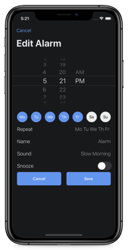
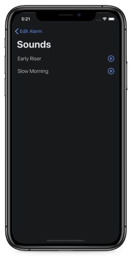

## Features
- Set time, repeat days, name, sound, snooze for some notifications
- Delete notification
- Turn on/turn off notifications
- Support for light & dark mode
- Play sound

## Used
- MVC
- CoreData
- UserNotifications
- Fully programmatically UI
- AutoLayout
- UserDefaults
- AVAudioPlayer
- UIKit

## Screenshots
|||||
|---|---|---|---|
|||||

## Source code
The source code for this app can be found at [GitHub](https://github.com/vlsuv/alarmv).