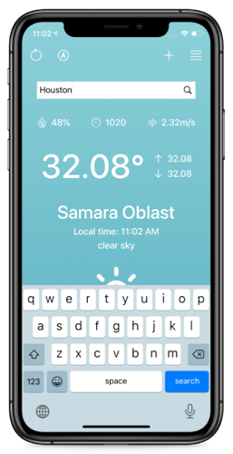
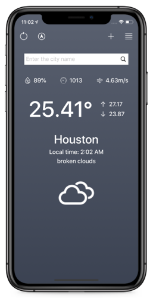
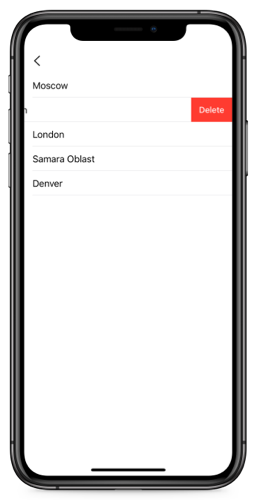

## Features
- Get current location
- Search any location
- Add location to favorites/Delete location from favorites
- Get current weather information
- Refresh weather information
- Change background by local time

## Used
- [OpenWeatherMap API](https://openweathermap.org/)
- MVC architecture
- UIKit
- Auto Layout
- RealmDatabase
- API Networking with URLSession
- CoreLocation
- CAGradientLayer
- CocoaPods
- Unit Tests

## User Interface
### Screenshots
| | | |
|---|---|---|
### Video


## Source code
The source code for this app can be found at [GitHub](https://github.com/vlsuv/CWeather).