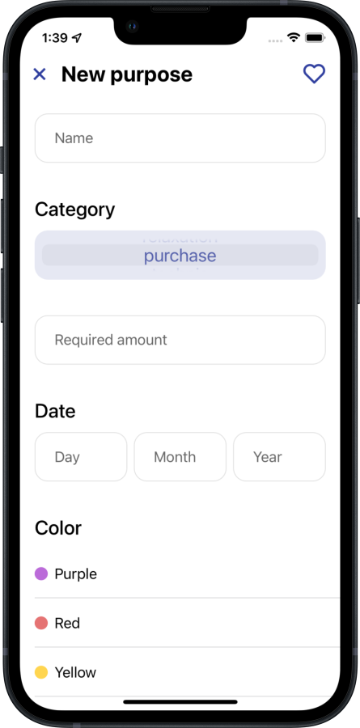
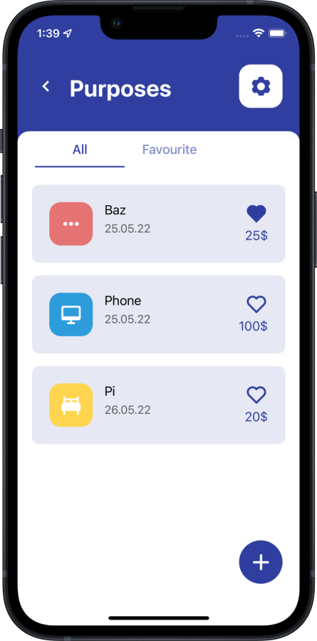

## Main features
- Fetching weather's info by current geo
- Adding expenses by category
- Planning goals with calendar
- Defining goals by categories

## My contribution
- All application

## Screenshots
|||||
|---|---|---|---|
|||||

## Links
- [App Store](https://apps.apple.com/ru/app/leastly/id1589946985?l=en)