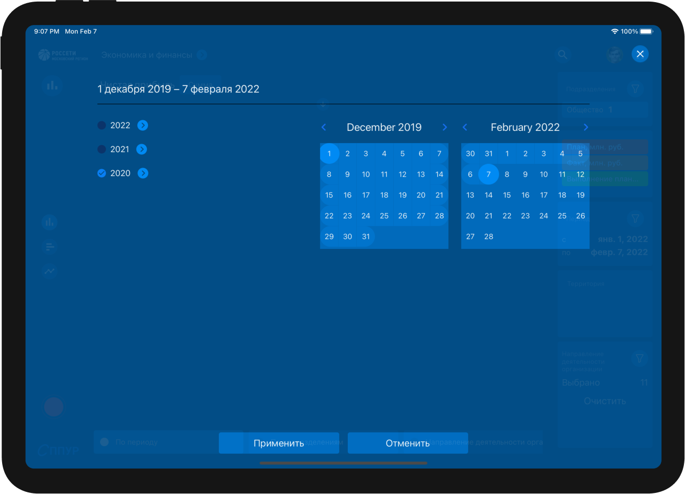
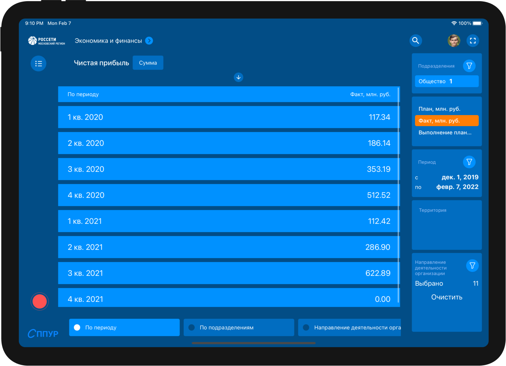
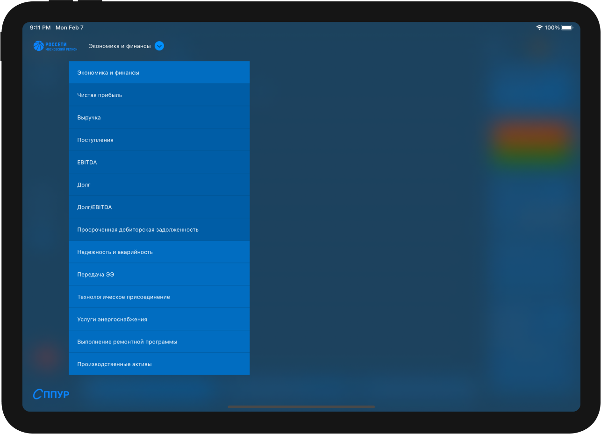
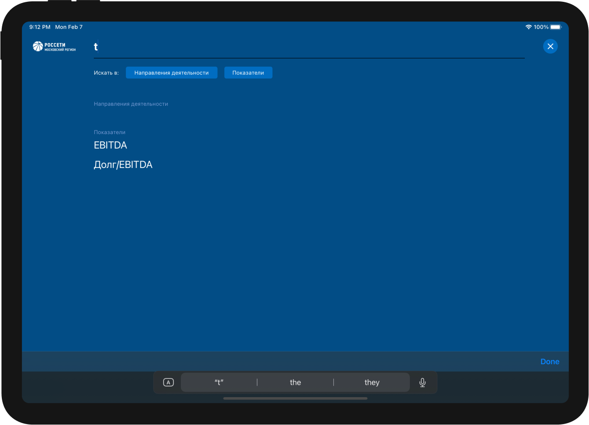
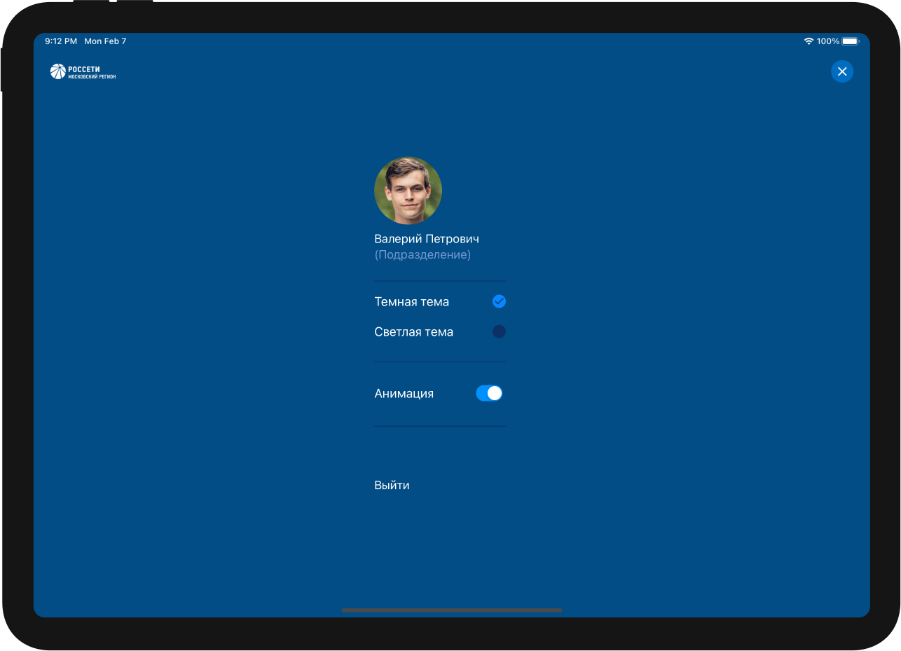
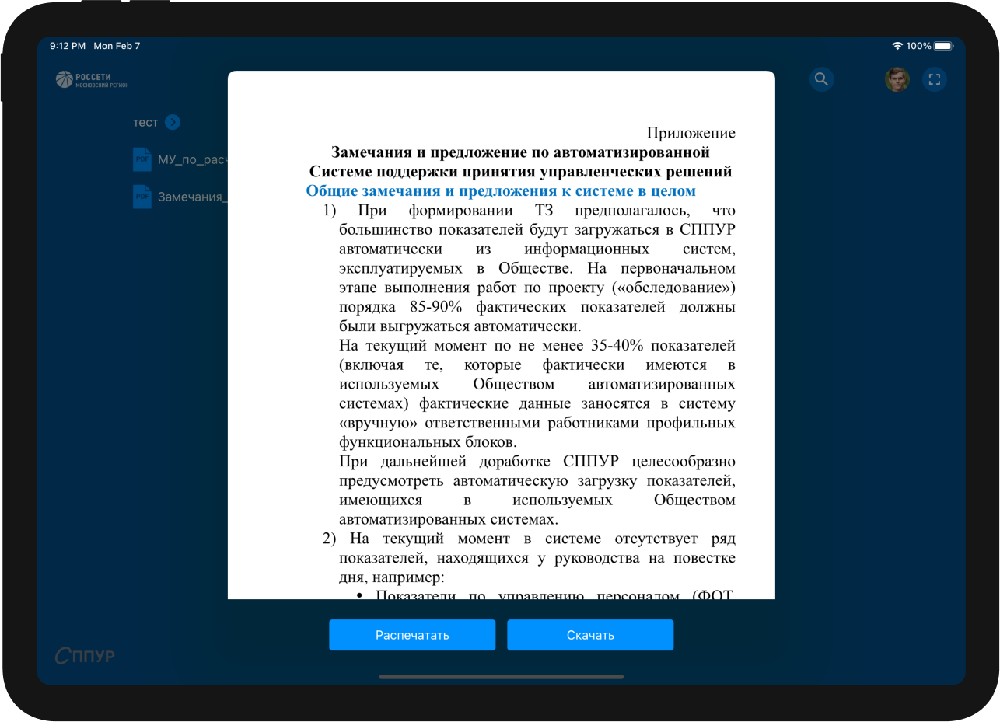
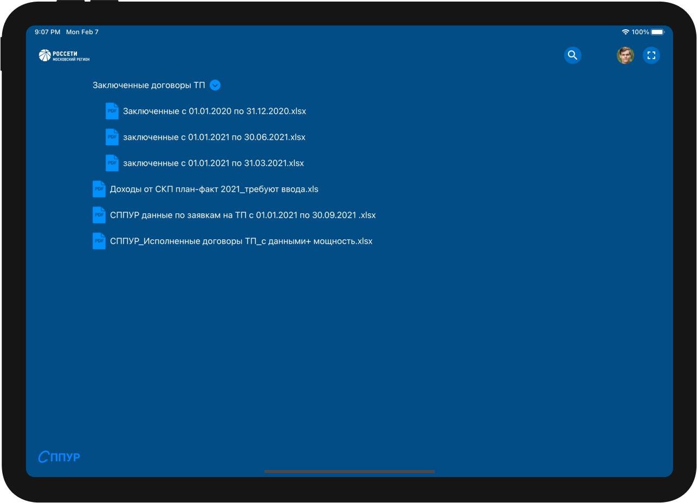
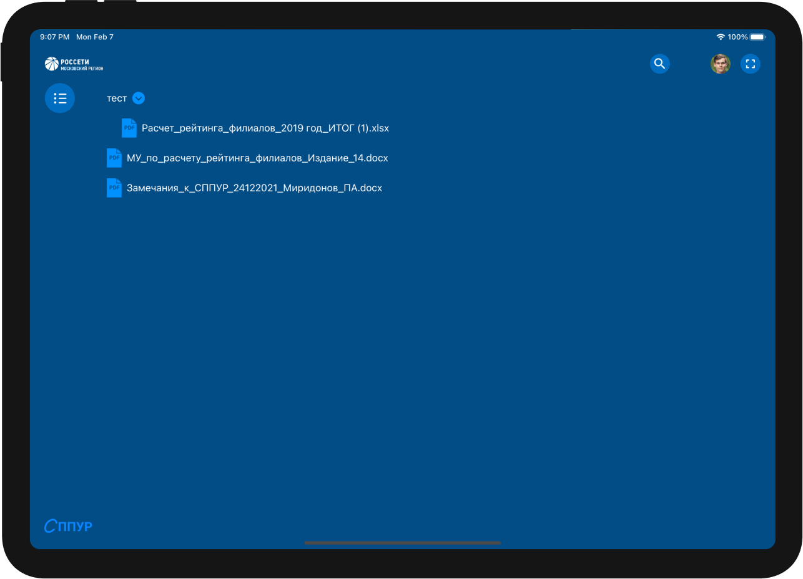

## My contribution
- Network layer
- Local storage 
- Data caching
- Auth both with internet connection and without it
- Showing data in vertical charts, horizontal charts, line charts, list  view
- All filters
- Selecting categories, measure unit, no negative values
- Interactive maps with selecting individual parts and showing their values
- Preview and printing of all documents and downloading 
- Calendar for a period filter
- Global search for cards and activities
- Changing theme and disable animation

## User Interface
### Screenshots
|||
|---|---|
|||
|||
|||
|||

### Videos
 
<strong>Charts</strong>
<video width=100% controls>
    <source src="videos/cards.mp4" type="video/mp4">
    Your browser does not support the video tag.  
</video>

<strong>Map</strong>
<video width=100% controls>
    <source src="videos/map.mp4" type="video/mp4">
    Your browser does not support the video tag.  
</video>

<strong>List</strong>
<video width=100% controls>
    <source src="videos/table.mp4" type="video/mp4">
    Your browser does not support the video tag.  
</video>


