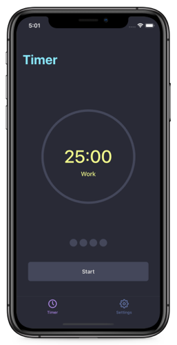
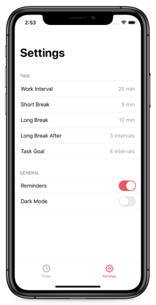
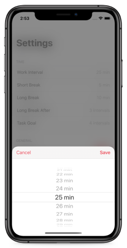

## Features
- Set work interval, short break, long break, long break after, task goal
- When app unactive, show notification about time finishing
- Turn on/turn off notifications
- Start, Pause, Stop timer
- Show work steps
- Show current timer type
- Timer works and saves data when application is not active
- Support for light & dark mode. Dark mode using [Drakula Color Pallete](https://draculatheme.com/contribute)
- Circle progress view is filling while timer is on

## Used
- MVP + Router
- AssemblyBuilder for creating modules
- UserNotifications
- Observers for NotificationCenter
- Fully programmatically UI; AutoLayout;
- UserDefaults
- CABasicAnimation; CAShapeLayer
- UIVisualEffectView
- UIPresentationController
- UIKit

## Screenshots
|   |  |  | | 
|---|---|---|---|
|  |  |  |  |

## Source code
The source code for this app can be found at [GitHub](https://github.com/vlsuv/pomodoro).

