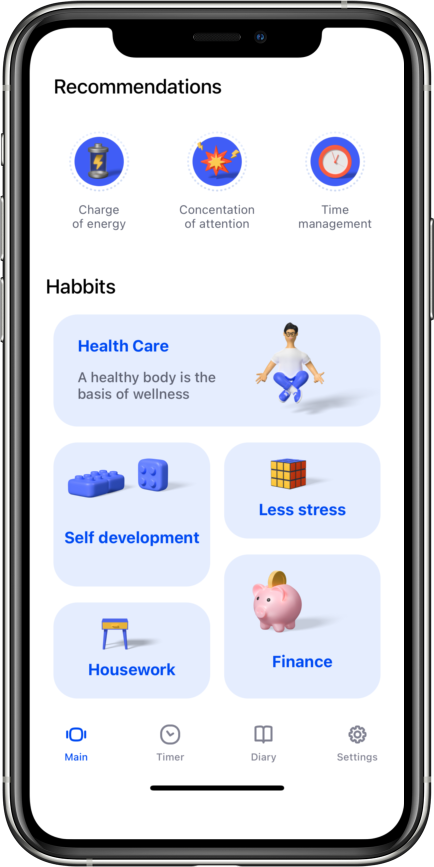
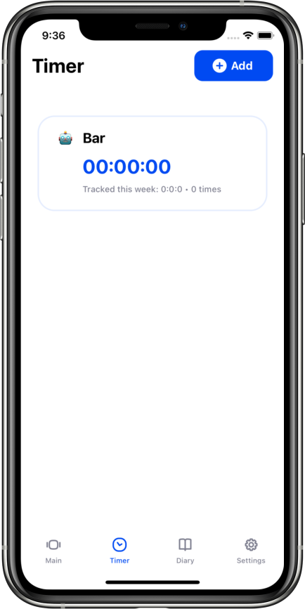

## Main features
- Adding timer with icon, title, description, color
- Setting  and changing password
- Showing recommendations in stories
- Adding notes with title, description, image

## My contribution
- All application

## Screenshots
|||||
|---|---|---|---|
||||

## Source
- [App Store](https://apps.apple.com/ru/app/tixxe/id1603998943?l=en)