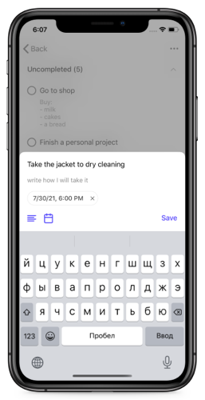
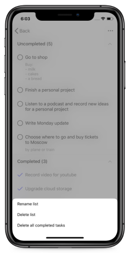
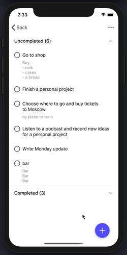

## Features
### Lists
- Create list for tasks
- Delete and rename list
- Change list's order by dragging

### Tasks
- Add task with title, description, reminder
- Edit task's title, description, reminder
- Delete tasks
- Change task's done status
- Delete all completed tasks
- Search any task by title
- Move task to any list
- Change task's order by dragging

### User-Interface
Visually look in the graph [Visual-User-Interface](#Visual-User-Interface)

Most of the icons by [Feather Icons](https://feathericons.com/)

- Some pages can be moved by touch and closed with a swipe down
- Start editing mode with long press
- Tasks columns can be expanded and hidden with animation
- The size of some pages depends on the content
- Animated resizing of some pages
- Dynamically size some cells

## Used
- MVP + Coordinators
- AssemblyBuilder for creating modules
- Realm & RealmSwift
- CocoaPods
- UIKit
- UserNotificationCenter
- AutoLayout
- Without the use of storyboards

## Screenshots
### Tasks
||||
|---|---|---|

### Lists
|||
|---|---|

### Other
||||
|---|---|---|
||| |

## Visual-User-Interface
||||
|---|---|---|
||| |

## Source code
The source code for this app can be found at [GitHub](https://github.com/vlsuv/to-do-list).
