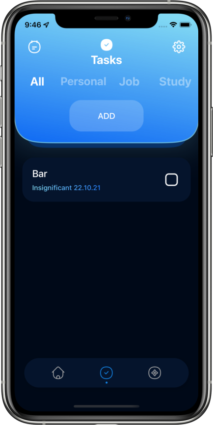
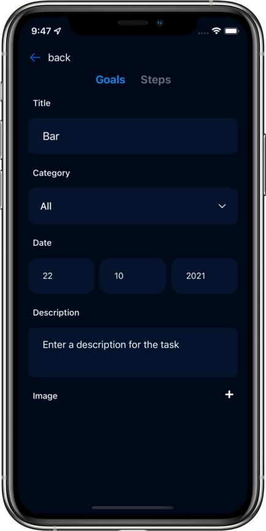
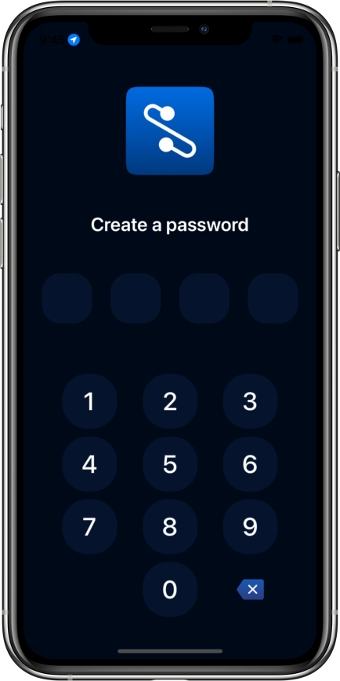

## My contribution
- User Interface
- Fetching weather's info by the current geo
- Calendar with marks
- To-do list with categories, dates, priority, description, subtasks
- Planner with categories, dates, description, pictures, steps
- Popular recommendations
- Settings

## Screenshots
||||
|---|---|---|
||||

## Links
- [App Store](https://apps.apple.com/ru/app/wixsy/id1610605206?l=en)